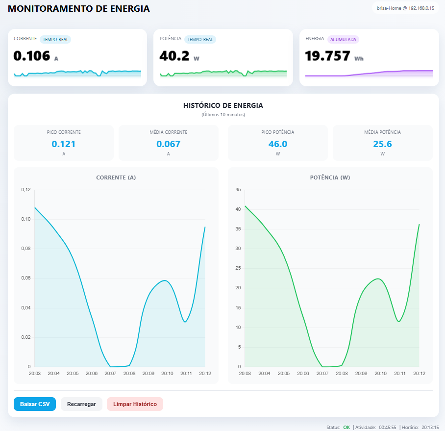

# Monitoramento de Energia

> Sistema de monitoramento de energia elétrica em tempo real baseado em ESP8266 e sensor SCT-013, com interface web responsiva, gráficos históricos e API REST.


## Sobre o Projeto

O sistema proposto é uma solução IoT desenvolvida para medir o consumo de energia elétrica de uma residência ou equipamento específico. Ele lê a corrente através de um sensor não invasivo (SCT-013), calcula a potência e o consumo acumulado (Wh), e disponibiliza esses dados em uma painel web responsivo acessível via navegador, sem necessidade de conexão externa com a internet.

### Funcionalidades Principais

- **Monitoramento em Tempo Real:** Visualização de Corrente (A), Potência (W) e Energia (Wh).
- **Painel Web:** Interface responsiva armazenada na memória do microcontrolador.
- **Gráficos Históricos:** Visualização de tendências de consumo e corrente.
- **Persistência de Dados:** Armazenamento de histórico em arquivo CSV na memória Flash (LittleFS).
- **API REST:** Endpoints JSON para integração com outros sistemas (Home Assistant, Node-RED, etc).
- **Exportação de Dados:** Download direto do histórico em formato CSV.

## Painel de Monitoramento de Energia




## Começando

Para configurar e rodar este projeto, consulte a documentação detalhada nos links abaixo:

1. **[Hardware ](docs/md/hardware.md)**: Lista de componentes e esquema de ligação do sensor.
2. **[Instalação e Configuração ](docs/md/setup.md)**: Como configurar o ambiente, editar credenciais WiFi e fazer o upload.
3. **[Arquitetura do Sistema ](docs/md/architecture.md)**: Visão geral de como os módulos se comunicam.
4. **[Armazenamento de Dados ](docs/md/storage.md)**: Detalhes sobre o buffer circular e arquivos CSV.

## Estrutura do Projeto

```text
├── docs/               # Documentação detalhada do projeto
├── include/            # Arquivos de cabeçalho (.h) e Configurações
│   ├── config.h        # Configurações globais (WiFi, Pinos, Calibração)
│   ├── web_ui.h        # Frontend (HTML/CSS/JS) minificado em PROGMEM
│   └── ...             # Headers das classes (EnergySensor, DataStorage, etc)
├── src/                # Código fonte (.cpp)
│   ├── main.cpp        # Loop principal e setup
│   ├── energy_sensor.* # Lógica de leitura do sensor SCT-013
│   ├── data_storage.*  # Gerenciamento de dados, buffer e CSV (LittleFS)
│   ├── web_server.*    # Servidor HTTP e rotas da API
│   └── wifi_manager.*  # Gerenciamento de conexão WiFi
└── platformio.ini      # Configuração do ambiente PlatformIO
```

## Tecnologias Utilizadas

- **Microcontrolador:** ESP8266 (NodeMCU / Wemos D1 Mini)
- **Linguagem:** C++ (Arduino Framework)
- **IDE:** VS Code + PlatformIO
- **Frontend:** HTML5, CSS3, JavaScript (Vanilla), Chart.js
- **Armazenamento:** LittleFS (Sistema de arquivos na Flash)

---

**Desenvolvido para o Projeto EmbarcaTech.**
