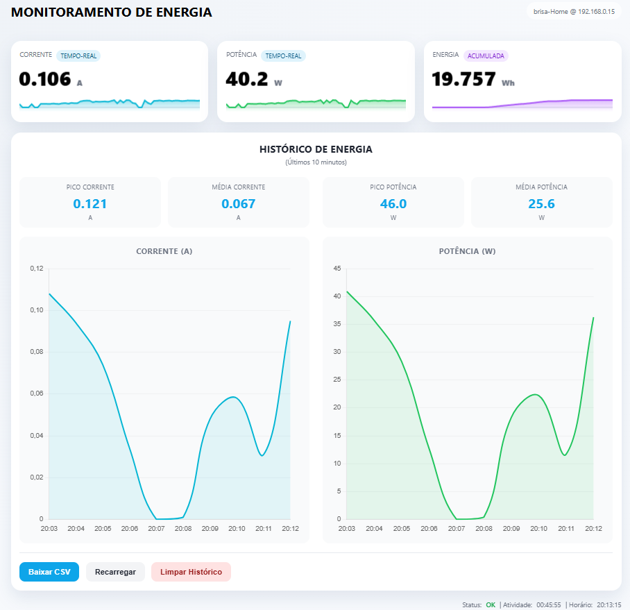
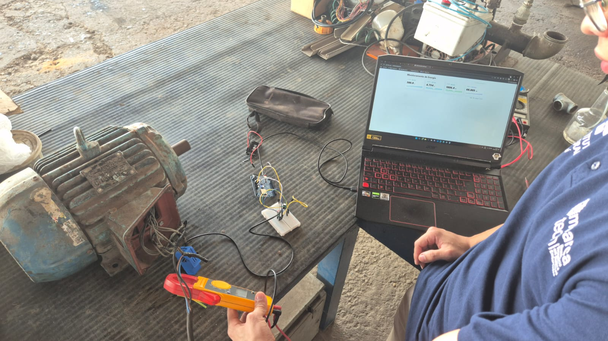
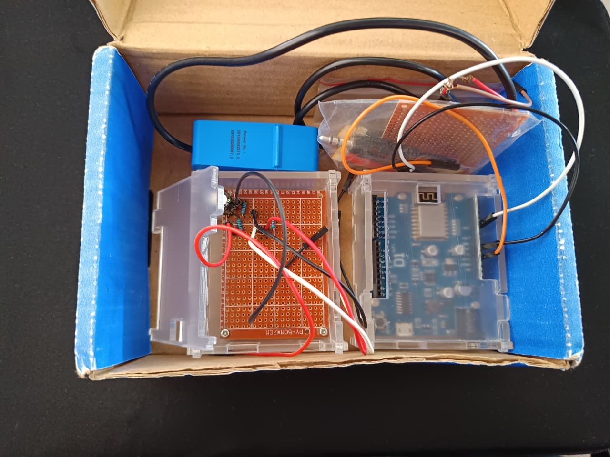

# PowerTrack

> Monitoramento de consumo elétrico em tempo real via interface web integrada




## Visualização do Projeto

### Medição e componentes do sistema

<div align="center">
  
  <br><br>
  
</div>

## Sobre

PowerTrack é um sistema IoT para monitoramento de consumo de energia elétrica desenvolvido em ESP8266. Utiliza um sensor não invasivo (SCT-013) para medir corrente, calcula potência e consumo acumulado, e disponibiliza os dados através de uma interface web responsiva acessível localmente — sem necessidade de conexão com a internet.

A solução é modular, com separação clara entre camadas de hardware, dados, apresentação e conectividade. Os dados são persistidos localmente em CSV com agregação inteligente, permitindo análise histórica e exportação dos registros.

## Destaques

- ⚡ Monitoramento em tempo real (Corrente, Potência, Energia acumulada)
- 📊 Gráficos históricos de tendências de consumo
- 💾 Persistência local de dados com arquivo CSV
- 🌐 Interface web responsiva sem dependência de internet externa
- 🔌 API REST para integração com Home Assistant, Node-RED e outros sistemas
- 📥 Exportação de histórico diretamente do microcontrolador

## Como Funciona

PowerTrack segue uma arquitetura modular em **4 camadas principais**:

### 1. Hardware (EnergySensor)
Lê o sensor SCT-013 via conversor analógico-digital, aplica calibração e filtra ruído para obter a corrente RMS. A partir da corrente e da tensão de rede configurada, calcula a potência instantânea e energia acumulada.

### 2. Armazenamento (DataStorage)
Implementa um buffer circular em RAM para manter os últimos dados e agrega leituras a cada 60 segundos. Os dados agregados são persistidos em arquivo CSV na memória Flash (LittleFS), com rotação automática para evitar overflow.

### 3. Servidor Web (WebServer)
Implementa rotas HTTP para servir a interface web e disponibilizar API REST. A interface inteira (HTML, CSS, JavaScript) está embarcada na memória do microcontrolador como string comprimida.

### 4. Conectividade (WiFiManager)
Gerencia a conexão WiFi com timeout inteligente, permitindo operação offline se a rede não estiver disponível. Utiliza mDNS para descoberta automática local.

**Fluxo de execução:**
```
Sensor (1s) → Buffer Circular (RAM) → Agregação (60s) → CSV (LittleFS) → WebServer (HTTP)
```

## Tecnologias

| Categoria | Tecnologia |
|-----------|-----------|
| Plataforma | ESP8266 (NodeMCU / Wemos D1 Mini) |
| Linguagem | C++ com Arduino Framework |
| Build | PlatformIO + VS Code |
| Hardware | Sensor SCT-013 (corrente não invasivo) |
| Armazenamento | LittleFS (sistema de arquivos em Flash) |
| Frontend | HTML5, CSS3, JavaScript Vanilla |
| Gráficos | Chart.js |
| Conectividade | WiFi 802.11b/g/n + mDNS |

## Estrutura do Projeto

```text
.
├── src/                          # Código-fonte
│   ├── main.cpp                  # Loop principal e setup
│   ├── energy_sensor.cpp         # Leitura do sensor SCT-013
│   ├── data_storage.cpp          # Buffer circular e persistência CSV
│   ├── web_server.cpp            # Rotas HTTP e API REST
│   └── wifi_manager.cpp          # Gerenciamento de conectividade
│
├── include/                      # Headers e configurações
│   ├── config.h                  # WiFi, pinos, calibração e timing
│   ├── energy_sensor.h
│   ├── data_storage.h
│   ├── web_server.h
│   ├── web_ui.h                  # Frontend inteiro em PROGMEM
│   └── wifi_manager.h
│
├── docs/                         # Documentação completa
│   ├── md/
│   │   ├── hardware.md           # Componentes e esquema do sensor
│   │   ├── setup.md              # Instalação e configuração
│   │   ├── architecture.md       # Visão geral da arquitetura
│   │   ├── backend.md            # Detalhes das classes C++
│   │   ├── frontend.md           # Estrutura do web_ui.h
│   │   ├── storage.md            # Buffer circular e persistência
│   │   └── api.md                # Endpoints REST documentados
│   │
│   ├── img/
│   │   ├── painel_de_monitoramento.png
│   │   ├── diagrama_do_fluxo_de_dados.png
│   │   └── circuito_divisor_de_tensao.png
│   │
│   └── csv/
│       └── data_energy.csv       # Exemplo de histórico de consumo
│
├── platformio.ini                # Configuração do projeto
└── README.md                     # Este arquivo
```

## Início Rápido

### Pré-requisitos

- VS Code com extensão PlatformIO
- Python 3 (necessário para PlatformIO)
- Microcontrolador ESP8266 (NodeMCU ou Wemos D1 Mini)
- Sensor SCT-013 e componentes de suporte (ver [Hardware](docs/md/hardware.md))

### Instalação

1. Clone o repositório:
   ```bash
   git clone https://github.com/otaviossousa/powertrack.git
   cd powertrack
   ```

2. Abra em VS Code com PlatformIO e configure as credenciais WiFi em [`include/config.h`](include/config.h):
   ```cpp
   #define WIFI_SSID "seu-wifi"
   #define WIFI_PASSWORD "sua-senha"
   ```

3. Configure a calibração do sensor (ver [Hardware](docs/md/hardware.md) para detalhes):
   ```cpp
   #define SENSOR_CALIBRATION 84.8  // Ajuste conforme seu sensor
   ```

4. Compile e faça upload para o ESP8266:
   - No PlatformIO: `Build` → `Upload` (ou clique em Upload no VS Code)

5. Acesse a interface web:
   - Via navegador em: `http://monitoramentodeenergia.local` (mDNS)
   - Ou use o IP do ESP8266 diretamente

Para instruções detalhadas, consulte [Instalação e Configuração](docs/md/setup.md).

## API REST

Os endpoints disponíveis permitem integração com sistemas de automação:

| Método | Endpoint | Descrição |
|--------|----------|-----------|
| GET | `/` | Interface web |
| GET | `/api` | Estado atual (corrente, potência, energia) |
| GET | `/net` | Informações de rede (SSID, IP) |
| GET | `/api/history` | Array histórico dos últimos pontos |
| GET | `/api/csv` | Download do arquivo data.csv |

**Exemplo de resposta `/api`:**
```json
{
  "i": "0.085A",
  "p": "32.5W",
  "e": "1.154Wh"
}
```

Para integração com Home Assistant, Node-RED ou outros sistemas, consulte [API](docs/md/api.md).

## Documentação Completa

A documentação está organizada em seções específicas:

- **[Hardware](docs/md/hardware.md)** — Lista de componentes, esquema de ligação do sensor SCT-013 e calibração
- **[Instalação](docs/md/setup.md)** — Configuração do ambiente, WiFi e upload
- **[Arquitetura](docs/md/architecture.md)** — Visão geral da arquitetura e fluxo de dados
- **[Backend](docs/md/backend.md)** — Detalhes das classes C++ e lógica de execução
- **[Frontend](docs/md/frontend.md)** — Estrutura do web_ui.h, componentes e estilos
- **[Armazenamento](docs/md/storage.md)** — Buffer circular, agregação de dados e persistência CSV
- **[API](docs/md/api.md)** — Endpoints REST documentados com exemplos

## Desafios Técnicos

A implementação do PowerTrack envolve vários desafios que foram resolvidos:

- **Leitura do Sensor com Precisão:** Integração com EmonLib para cálculos de corrente RMS e potência com calibração empírica
- **Limitações de Memória:** Uso de buffer circular em RAM com agregação inteligente para 24h de dados sem overflow
- **Operação Não-Bloqueante:** Loop principal implementado sem delays bloqueantes, garantindo responsividade do servidor HTTP mesmo durante coleta de dados
- **Persistência em Flash:** Estratégia de rotação de arquivo CSV para evitar fragmentação e perda de dados
- **Conectividade Resiliente:** WiFiManager com timeout inteligente para não travar o sistema se a rede cair
- **Interface Web Embarcada:** Frontend inteiro armazenado em PROGMEM comprimido, servido localmente sem servidor externo

## Aprendizados

Este projeto demonstra e pratica:

- Desenvolvimento de firmware em C++ com Arduino Framework
- Integração de sensores analógicos e processamento de sinais
- Padrões de design em software embarcado (separação de camadas, modulação)
- Gerenciamento eficiente de memória em sistemas com recursos limitados
- Implementação de servidor HTTP não-bloqueante em microcontrolador
- Comunicação entre hardware e frontend via API REST
- Persistência de dados em sistemas embarcados (LittleFS)
- Desenvolvimento de interface web responsiva com JavaScript Vanilla

## Próximos Passos

Melhorias planejadas para o projeto:

- Autenticação e controle de acesso web
- Alertas e notificações por consumo excessivo
- Integração com mais plataformas de automação

## Licença

MIT — Consulte o arquivo LICENSE para detalhes.

---

**Desenvolvido para o Projeto EmbarcaTech.**
